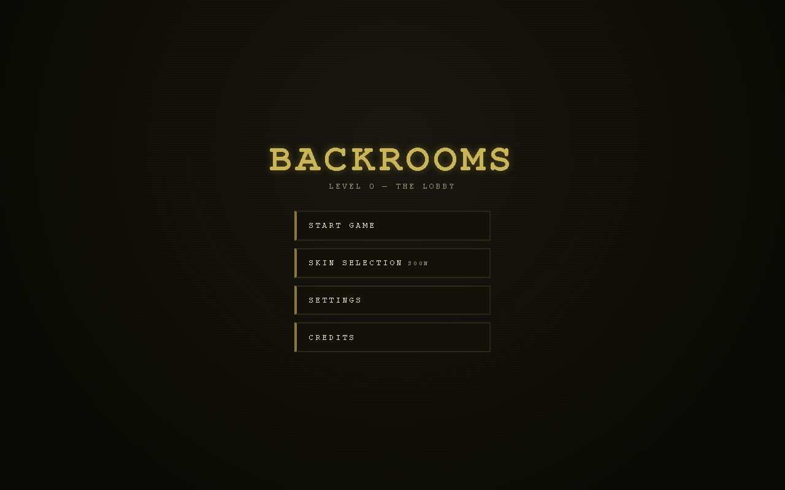
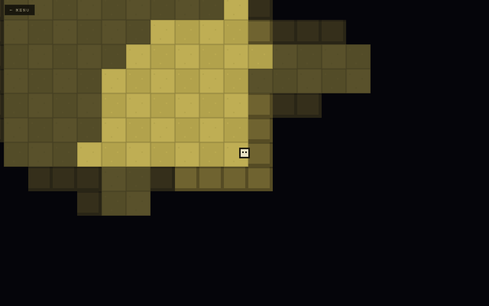
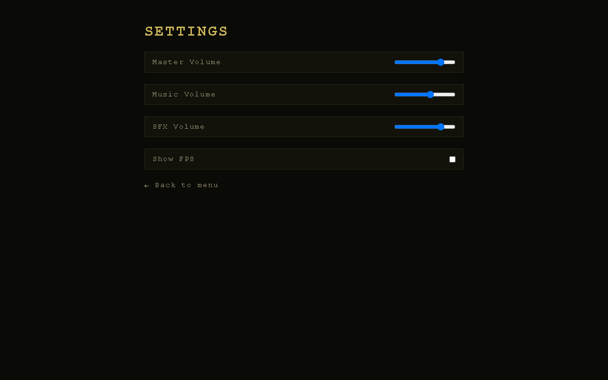
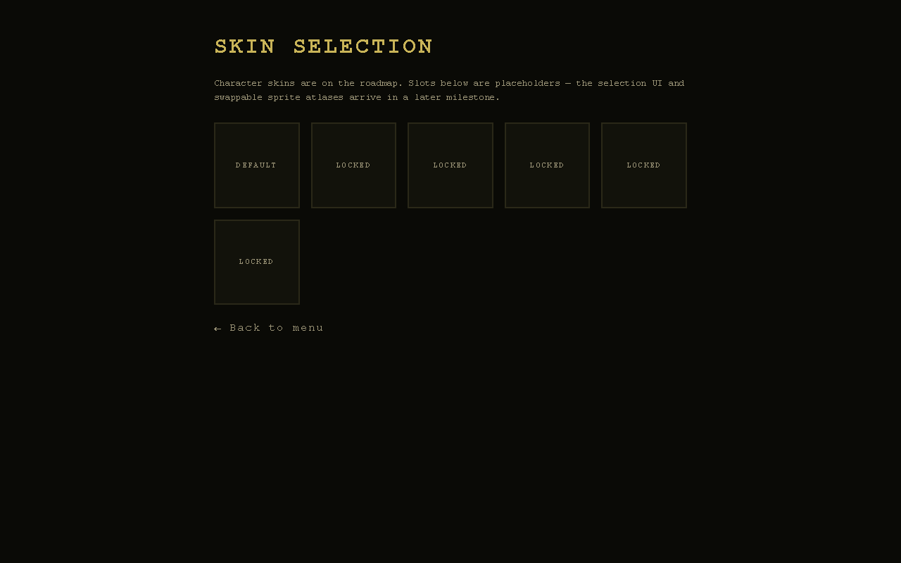

# Backrooms 2D

A performant, browser-based **2D pixel-art Backrooms horror game**. Next.js
serves as the app shell (menu, settings, overlays); **all gameplay runs in
Phaser** — Next.js and React never touch the game loop.

## Screenshots

| Main menu | In-game (fog of war + line of sight) |
| --- | --- |
|  |  |

| Settings | Skin selection (placeholder) |
| --- | --- |
|  |  |

## Goals

- Explorable 2D Backrooms with rooms and corridors across multiple levels.
- Line-of-sight visibility with fog of war and hidden, discoverable corridors.
- Monster AI (patrol / search / chase / attack / lost) — foundation first.
- Clean separation of app state and game state, testable game logic.
- Pixel-art rendering via WebGL, no React re-rendering during the game loop.

## Tech Stack

| Layer       | Choice                            |
| ----------- | --------------------------------- |
| App shell   | Next.js (App Router), React, TS   |
| Game engine | Phaser (WebGL, Arcade physics)    |
| Validation  | Zod (settings, saves, level data) |
| Lint/format | ESLint (flat config), Prettier    |
| Unit tests  | Vitest (isolated game logic)      |
| E2E tests   | Playwright (app smoke tests)      |

## Getting Started

```bash
npm install
npm run dev        # http://localhost:3000
```

From the main menu: **Start Game** to play, **WASD / Arrow keys** to move.

## Scripts

| Script              | Purpose                    |
| ------------------- | -------------------------- |
| `npm run dev`       | Start the dev server       |
| `npm run build`     | Production build           |
| `npm run start`     | Serve the production build |
| `npm run lint`      | ESLint                     |
| `npm run format`    | Prettier write             |
| `npm run typecheck` | `tsc --noEmit` (strict)    |
| `npm run test`      | Vitest unit tests          |
| `npm run test:e2e`  | Playwright smoke tests     |

## Architecture Overview

```
src/
  app/                 Next.js App Router — the app shell (React/UI only)
    page.tsx           Main menu
    game/              Game page + client-only Phaser mount
    settings/          Settings screen (persisted via zod-validated store)
    credits/  skins/   Static + placeholder screens
  game/                Phaser game — no React here
    core/              Game factory
    scenes/            Boot -> Preload -> Main lifecycle
    entities/          Player (and later monsters)
    systems/           Input, audio (pooling/effects later)
    ai/                Monster state machine (engine-independent)
    visibility/        Fog of war + line-of-sight (engine-independent)
    levels/            Level data + registry
    config/            Constants
  lib/                 Shared, engine-agnostic code
    schemas/           Zod schemas: settings, savegame, level
    storage.ts         Safe localStorage access
    settings-store.ts  App <-> game settings bridge (no React in the loop)
tests/e2e/             Playwright specs
docs/                  Architecture, roadmap, planning, system designs
```

The **boundary rule**: React handles menus, settings, and overlays. Phaser owns
rendering, camera, movement, collisions, scenes, tilemaps, animation, and audio.
The only bridge between them is the settings store (`src/lib/settings-store.ts`),
a tiny observable read by both sides — never React state driving the game.

See [`docs/game-architecture.md`](docs/game-architecture.md) for details.

## Documentation

- [Game architecture](docs/game-architecture.md)
- [Feature roadmap](docs/feature-roadmap.md)
- [GitHub project plan](docs/github-project-plan.md)
- [Visibility system](docs/visibility-system.md)
- [Monster AI plan](docs/monster-ai-plan.md)
- [Contributing](CONTRIBUTING.md)
