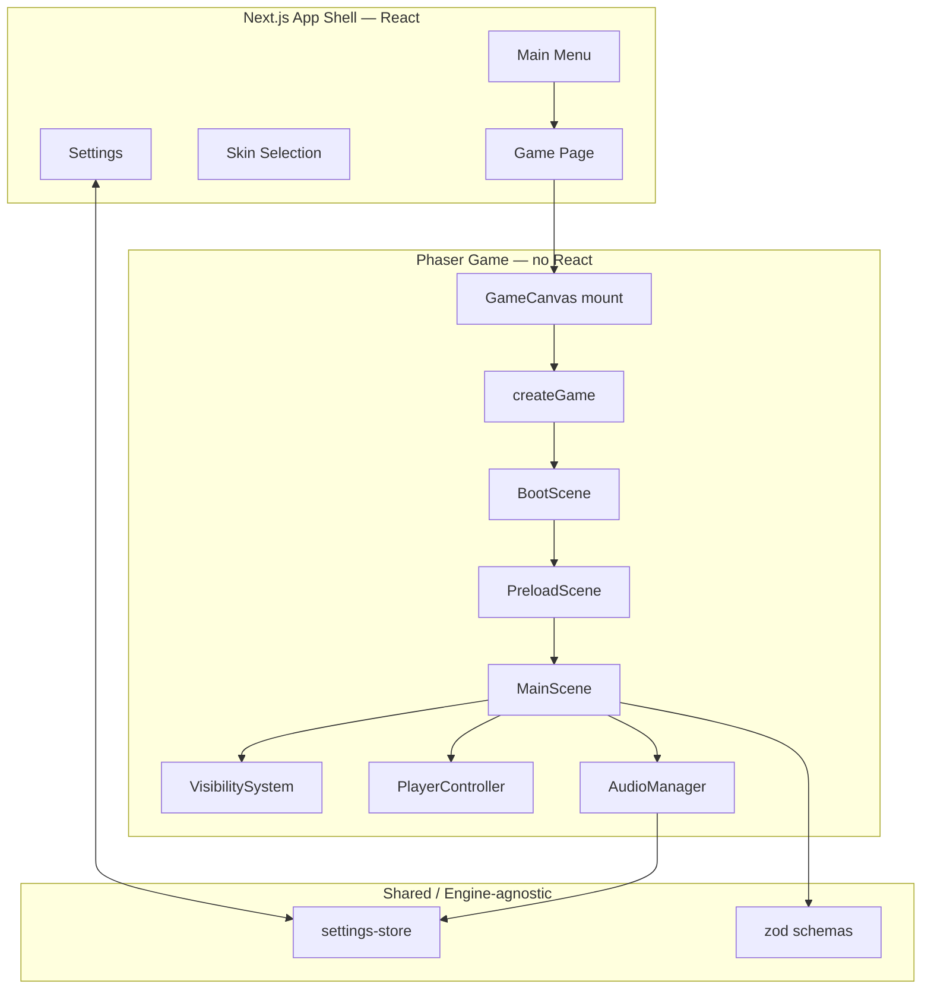
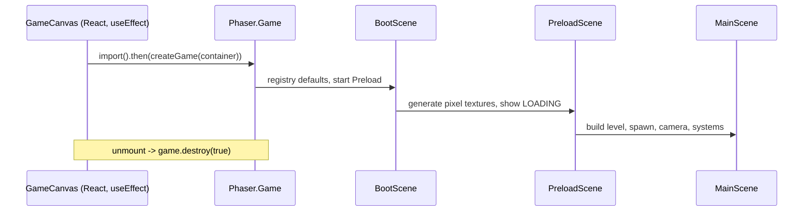

# Game Architecture

## Principle: App Shell vs. Game

Next.js is an **app shell only**. It owns routing and the React UI (menu,
settings, credits, skins, HUD overlays, later web features). It must never drive
the game loop, movement, AI, collisions, or visibility.

Phaser owns everything inside the running game: rendering, camera, input,
movement, collisions, scenes, tilemaps, animation, and audio.

## The Boundary Bridge

The only channel between React and Phaser is
[`src/lib/settings-store.ts`](../src/lib/settings-store.ts): a tiny observable
holding validated `Settings`.

- React reads/writes it through `useSettings` (via `useSyncExternalStore`).
- Phaser reads it directly (`getSettings`) and subscribes where needed
  (`AudioManager`). No React state ever flows into the game loop.

This keeps app re-renders and the 60 fps loop fully decoupled.

## Scene Lifecycle

`GameCanvas` dynamically imports the game factory inside `useEffect`, so Phaser
is never evaluated on the server and is torn down cleanly on unmount.

## MainScene Responsibilities

- Validate + load level data (`getLevel`), build floor images and a static wall
  group for collisions.
- Spawn the `Player`, attach `PlayerController`, add the wall collider, start
  the camera follow.
- Build the fog grid and drive `VisibilitySystem`; recompute only when the
  player crosses a tile boundary (not every frame).
- Track hidden-zone discovery and keep hidden corridors concealed until entered.

## Data Validation

All persisted or imported data is validated with Zod before use:

- `Settings` — clamped, versioned; invalid input falls back to defaults.
- `SaveGame` — versioned; invalid input rejected (returns `null`).
- `LevelData` — dimensions, tile count, spawn bounds, and zones checked.

## Performance Rules

- No allocation in `update()`; `PlayerController` reuses one `Vector2`.
- Visibility and fog refresh are gated on tile-boundary changes.
- `VisibilitySystem` and `MonsterStateMachine` are engine-independent and unit
  tested in isolation.
- Object pooling for monsters, particles, and effects is planned once those
  systems land (see the roadmap).

## Extensibility

- **Levels**: add a `LevelData` to `src/game/levels` and register it. Levels can
  later be authored as external JSON and validated on import.
- **Skins**: `skinId` already lives in settings; swap the player atlas keyed by
  it without touching movement.
- **Monsters**: `MonsterStateMachine` is ready; wire an entity + perception
  provider into `MainScene`.
