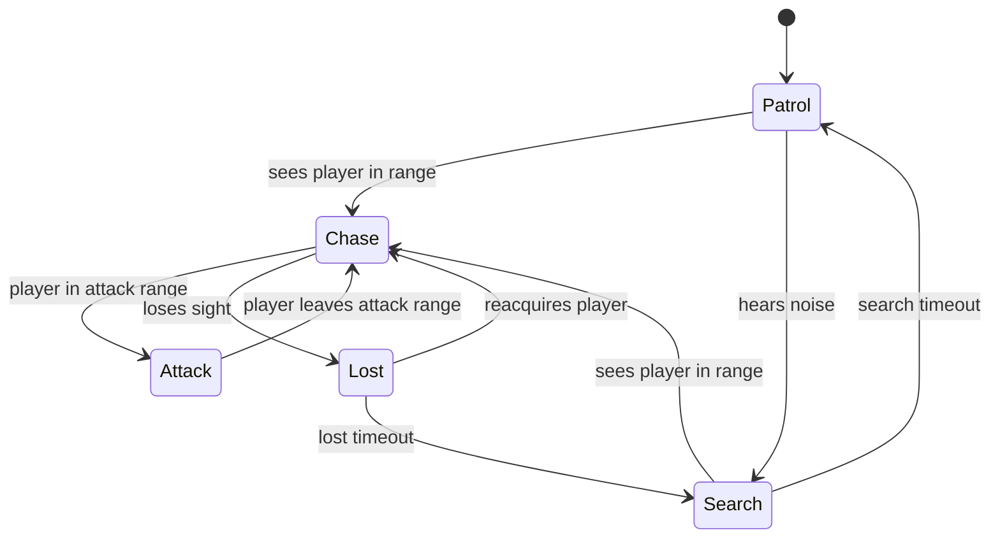

# Monster AI Plan

Implementation: [`src/game/ai/MonsterStateMachine.ts`](../src/game/ai/MonsterStateMachine.ts)
Types: [`src/game/ai/types.ts`](../src/game/ai/types.ts)
Tests: [`MonsterStateMachine.test.ts`](../src/game/ai/MonsterStateMachine.test.ts)

## Design

The brain is a deterministic, **engine-independent** finite state machine. It
consumes a per-tick `Perception` snapshot and returns the current state. The
scene owns movement, animation, and pathing; the FSM only decides intent. This
keeps behaviour fully unit testable without Phaser.

## States



| State  | Behaviour (scene-side)                        |
| ------ | --------------------------------------------- |
| Patrol | follow patrol path / wander                   |
| Search | move to last-known position, sweep            |
| Chase  | path toward the player                        |
| Attack | strike when in range                          |
| Lost   | hold / scan briefly, then downgrade to Search |

## Perception

```ts
interface Perception {
  canSeePlayer: boolean; // line of sight (reuse VisibilitySystem LOS)
  distanceToPlayer: number; // world units
  heardNoise: boolean; // sprint/interaction noise events
}
```

Detection sources, in priority order:

1. **Line of sight** — same Bresenham primitive as the visibility system.
2. **Distance** — `chaseRange` to engage, `attackRange` to strike.
3. **Noise** — player actions emit noise events that push Patrol -> Search.

`AiConfig` exposes `attackRange`, `chaseRange`, `searchTimeout`, and
`lostTimeout` so each monster type can be tuned without code changes.

## Integration Steps (Week 4)

1. ✅ `Monster` entity ([`src/game/entities/Monster.ts`](../src/game/entities/Monster.ts)) —
   arcade body, wall collision, owns the FSM and drives movement per state.
2. ✅ Perception provider ([`src/game/ai/perception.ts`](../src/game/ai/perception.ts)) —
   builds `Perception` from LOS (visibility Bresenham), distance, and queued
   noise events. Pure and unit tested.
3. ✅ `MainScene` calls `monster.think(deltaSeconds, perception, playerPos)` each
   frame; movement uses pure steering helpers
   ([`src/game/ai/steering.ts`](../src/game/ai/steering.ts)).
4. Object-pool monsters and their effects once many spawns are needed (future).

### Movement per state (scene-side)

- **Patrol** — walk the looping waypoint path from `level.monsters[].patrol`
  (stationary if empty).
- **Chase** — steer straight at the player; the current position is stored as
  last-known each frame.
- **Search** — go to the last-known position, then hold/sweep until the FSM
  `searchTimeout` downgrades to Patrol.
- **Attack** — stop and fire `onCatch` once (scene resets player + monsters).
- **Lost** — hold; the FSM downgrades to Search after `lostTimeout`.

### Detection inputs

- **Sight** — within `sightRange` **and** unobstructed LOS to the player tile.
- **Noise** — the player emits a noise event while **sprinting** (hold Shift);
  a monster within `hearingRange` registers it and investigates (Patrol →
  Search toward the player's position).

## Testing

The FSM has full transition coverage (patrol->chase, noise->search,
chase->attack->chase, chase->lost, lost->search). New behaviours must add
matching transition tests before wiring visuals.
