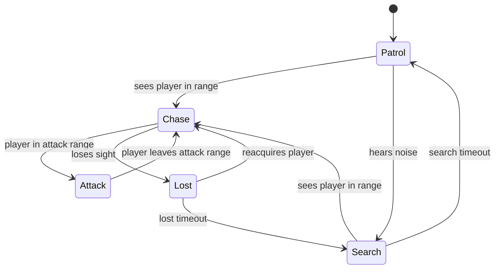

# Monster AI Plan

Implementation: [`src/game/ai/MonsterStateMachine.ts`](../src/game/ai/MonsterStateMachine.ts)
Types: [`src/game/ai/types.ts`](../src/game/ai/types.ts)
Tests: [`MonsterStateMachine.test.ts`](../src/game/ai/MonsterStateMachine.test.ts)

## Design

The brain is a deterministic, **engine-independent** finite state machine. It
consumes a per-tick `Perception` snapshot and returns the current state. The
scene owns movement, animation, and pathing; the FSM only decides intent. This
keeps behaviour fully unit testable without Phaser.

## States



| State  | Behaviour (scene-side)                        |
| ------ | --------------------------------------------- |
| Patrol | follow patrol path / wander                   |
| Search | move to last-known position, sweep            |
| Chase  | path toward the player                        |
| Attack | strike when in range                          |
| Lost   | hold / scan briefly, then downgrade to Search |

## Perception

```ts
interface Perception {
  canSeePlayer: boolean; // line of sight (reuse VisibilitySystem LOS)
  distanceToPlayer: number; // world units
  heardNoise: boolean; // sprint/interaction noise events
}
```

Detection sources, in priority order:

1. **Line of sight** — same Bresenham primitive as the visibility system.
2. **Distance** — `chaseRange` to engage, `attackRange` to strike.
3. **Noise** — player actions emit noise events that push Patrol -> Search.

`AiConfig` exposes `attackRange`, `chaseRange`, `searchTimeout`, and
`lostTimeout` so each monster type can be tuned without code changes.

## Integration Steps (Week 4)

1. Add a `Monster` entity (arcade body, animation).
2. Provide a perception provider that fills `Perception` from the scene
   (LOS to player, distance, queued noise events).
3. Call `stateMachine.update(deltaSeconds, perception)` each frame and drive
   movement from the returned state.
4. Object-pool monsters and their effects once multiple spawns are needed.

## Testing

The FSM has full transition coverage (patrol->chase, noise->search,
chase->attack->chase, chase->lost, lost->search). New behaviours must add
matching transition tests before wiring visuals.
