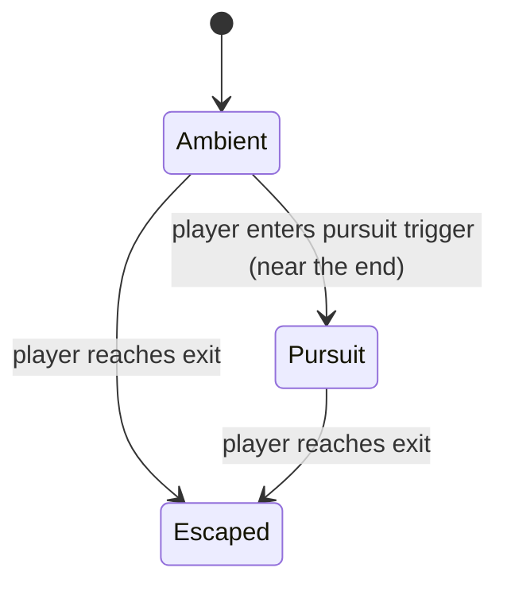
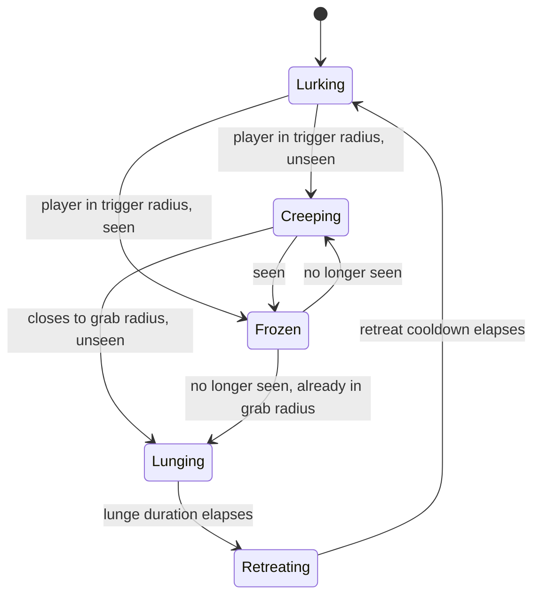
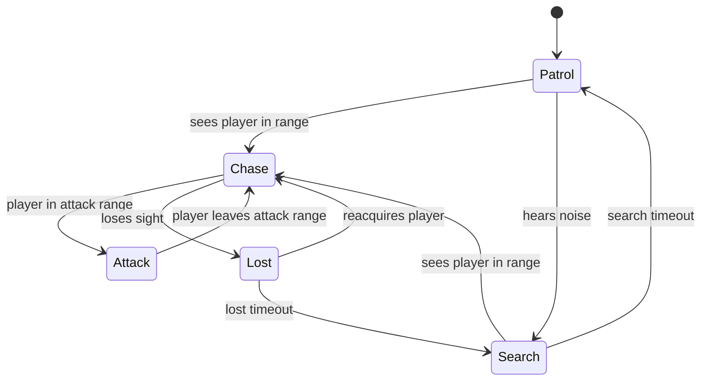

# Monster AI Plan

Pacing director: [`src/game/ai/MonsterDirector.ts`](../src/game/ai/MonsterDirector.ts)
The Stalker ("don't look away"): [`src/game/ai/StalkerAI.ts`](../src/game/ai/StalkerAI.ts)
Reactive FSM (library): [`src/game/ai/MonsterStateMachine.ts`](../src/game/ai/MonsterStateMachine.ts)
Types: [`src/game/ai/types.ts`](../src/game/ai/types.ts)

## Scripted dread (current behaviour)

The game is **not** a reactive-stealth hunt — it is a scripted scare. On Easy
the player cannot die; on Middle/Hard the chase (and the Stalker's lunge, see
below) are lethal. A [`MonsterDirector`](../src/game/ai/MonsterDirector.ts)
drives three phases:



| Phase   | Monster behaviour                                                                                                                                     |
| ------- | ----------------------------------------------------------------------------------------------------------------------------------------------------- |
| Ambient | Patrols its path, **indifferent to the player** — only glimpsed in passing and _heard_ when nearby (a growl + a dark screen pulse). Never approaches. |
| Pursuit | Wakes with a roar + camera jolt and **bee-lines the player** at `DREAD.pursuitSpeed` (above the walk, below the sprint — sprint to escape).           |
| Escaped | Freezes; the "ENTKOMMEN" overlay confirms the near-miss.                                                                                              |

The pursuit trigger and exit are level data (`pursuitTrigger`, `exit`), so the
"end" is authored (here, generated) per level. Sprint (hold **Shift**) is how
the player outruns the chase.

### Difficulty & lethality

Levels are procedurally generated ([`generate.ts`](../src/game/levels/generate.ts))
and the difficulty (`easy` / `middle` / `hard`, see `DIFFICULTY_CONFIG`) scales
size, room/monster count and the chase:

- **Easy** — never lethal. The chase is pure tension; reach the exit to escape.
- **Middle / Hard** — the pursuit **kills**: if a monster closes within
  `DREAD.killRadius` during Pursuit, the run ends in "GEFANGEN" and retries.
  Hard levels are larger, more complex and the monster is faster.

Progression across the official Backrooms levels (`officialLevels.ts`) is held
in the [progress store](../src/lib/progress-store.ts): escaping a level unlocks
and advances to the next; unlocked levels are replayable from the level-select
menu.

The reactive FSM below is retained as a tested library for a possible
higher-difficulty mode, but is not wired into the current pacing.

## Layered horror systems (rework)

Scripted dread sets the overall pacing; four independent systems layer on top
of it during the Ambient phase to make the level feel actively watched, not
just occasionally dangerous:

| System                          | File                                              | What it does                                                                                                                                                                                                                                                                                                                                                         |
| ------------------------------- | ------------------------------------------------- | -------------------------------------------------------------------------------------------------------------------------------------------------------------------------------------------------------------------------------------------------------------------------------------------------------------------------------------------------------------------- |
| **The Stalker**                 | [`StalkerAI.ts`](../src/game/ai/StalkerAI.ts)     | SCP-173 / Weeping-Angel mechanic: freezes solid the instant the player has line of sight on it, closes distance the instant they look away. See below.                                                                                                                                                                                                               |
| **Fear / heartbeat / vignette** | `MainScene.computeFear` / `updateFear`            | A 0..1 dread value from the single nearest threat each frame, driving `AudioManager.updateHeartbeat` (interval shrinks, thump gets louder) and a WebGL camera vignette (`FEAR` constants) that tightens and darkens. Explicitly relaxed (`relaxFear`) the instant a run ends so the outcome banner is never fighting a screen still darkened from the moment before. |
| **Jump-scares**                 | `MainScene.updateJumpscare` / `trySpawnJumpscare` | As before (a monster flashes into view and vanishes), now with a `JUMPSCARE.peekChance` fraction that are silent "peeks" — a silhouette that never approaches or attacks. Unsettling precisely because nothing happens.                                                                                                                                              |
| **Blackout flicker**            | `MainScene.updateBlackout` / `triggerBlackout`    | A random ambient power-flicker: screen briefly darkens with an electrical `AudioManager.staticBurst()`, no monster required. Pure atmosphere.                                                                                                                                                                                                                        |

Cues that have a source direction (`growl`, `shriek`, `scream`) accept a `pan`
(-1..1) so the stereo field hints at which side the threat is on. Attack/lunge
beats also pulse the WebGL barrel-distortion filter (`pulseBarrel`) for a
physical jolt alongside the camera flash and shake.

### The Stalker



A single persistent entity (`MainScene.spawnStalker`), independent of the
level's patrol monsters. While `Frozen` it holds dead still — no idle
hunch-and-lurch tween (`Monster.freezeStill`) — so the "did it just move?"
read is unambiguous. While `Creeping` it glides at `STALKER.creepSpeed`
without a leg-stride walk cycle (`Monster` constructor's `noWalkCycle`
option) — it shouldn't look like it's ambling, it should look like it's
simply _closer_ than it was. A lunge snaps it into the player's face
(`STALKER.lungeOffset`), screams, and either kills (lethal difficulties) or
just leaves the player rattled; it then fades out, teleports somewhere fresh
off-stage, and fades back in (`relocateStalker`) — it should never look like
it walked away. Hidden and frozen outside the Ambient phase so it doesn't
compete with the Pursuit finale.

"Seen" requires both line of sight (`VisibilitySystem.hasLineOfSight`,
reused from the fog-of-war system) **and** being within the fog reveal
radius — it can't be spotted through fog it hasn't already lit up.

## Reactive FSM (library, unused in-game)

### Design

The brain is a deterministic, **engine-independent** finite state machine. It
consumes a per-tick `Perception` snapshot and returns the current state. The
scene owns movement, animation, and pathing; the FSM only decides intent. This
keeps behaviour fully unit testable without Phaser.

## States



| State  | Behaviour (scene-side)                        |
| ------ | --------------------------------------------- |
| Patrol | follow patrol path / wander                   |
| Search | move to last-known position, sweep            |
| Chase  | path toward the player                        |
| Attack | strike when in range                          |
| Lost   | hold / scan briefly, then downgrade to Search |

## Perception

```ts
interface Perception {
  canSeePlayer: boolean; // line of sight (reuse VisibilitySystem LOS)
  distanceToPlayer: number; // world units
  heardNoise: boolean; // sprint/interaction noise events
}
```

Detection sources, in priority order:

1. **Line of sight** — same Bresenham primitive as the visibility system.
2. **Distance** — `chaseRange` to engage, `attackRange` to strike.
3. **Noise** — player actions emit noise events that push Patrol -> Search.

`AiConfig` exposes `attackRange`, `chaseRange`, `searchTimeout`, and
`lostTimeout` so each monster type can be tuned without code changes.

## Integration Steps (Week 4)

1. ✅ `Monster` entity ([`src/game/entities/Monster.ts`](../src/game/entities/Monster.ts)) —
   arcade body, wall collision, owns the FSM and drives movement per state.
2. ✅ Perception provider ([`src/game/ai/perception.ts`](../src/game/ai/perception.ts)) —
   builds `Perception` from LOS (visibility Bresenham), distance, and queued
   noise events. Pure and unit tested.
3. ✅ `MainScene` calls `monster.think(deltaSeconds, perception, playerPos)` each
   frame; movement uses pure steering helpers
   ([`src/game/ai/steering.ts`](../src/game/ai/steering.ts)).
4. Object-pool monsters and their effects once many spawns are needed (future).

### Movement per state (scene-side)

- **Patrol** — walk the looping waypoint path from `level.monsters[].patrol`
  (stationary if empty).
- **Chase** — steer straight at the player; the current position is stored as
  last-known each frame.
- **Search** — go to the last-known position, then hold/sweep until the FSM
  `searchTimeout` downgrades to Patrol.
- **Attack** — stop and fire `onCatch` once (scene resets player + monsters).
- **Lost** — hold; the FSM downgrades to Search after `lostTimeout`.

### Detection inputs

- **Sight** — within `sightRange` **and** unobstructed LOS to the player tile.
- **Noise** — the player emits a noise event while **sprinting** (hold Shift);
  a monster within `hearingRange` registers it and investigates (Patrol →
  Search toward the player's position).

## Testing

The FSM has full transition coverage (patrol->chase, noise->search,
chase->attack->chase, chase->lost, lost->search). New behaviours must add
matching transition tests before wiring visuals.
