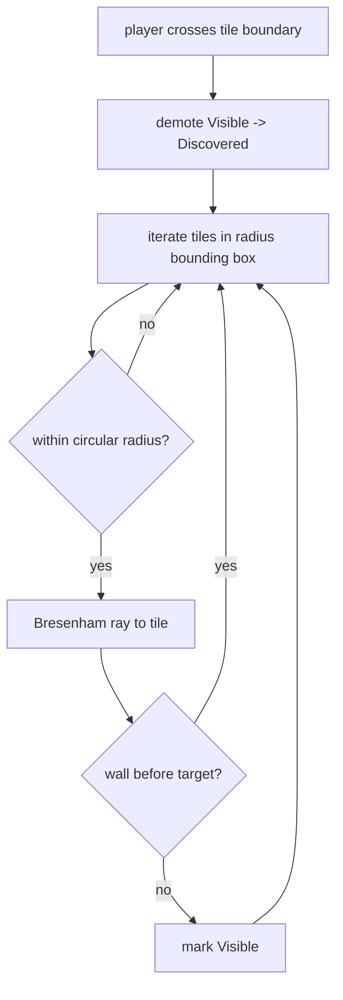

# Visibility System

Implementation: [`src/game/visibility/VisibilitySystem.ts`](../src/game/visibility/VisibilitySystem.ts)
Tests: [`VisibilitySystem.test.ts`](../src/game/visibility/VisibilitySystem.test.ts)

## Goals

- The player only sees rooms/corridors within reveal radius **and** line of
  sight.
- Explored-but-not-visible areas dim rather than vanishing (memory).
- Some corridors stay fully hidden until physically discovered.
- Cheap enough to run on large grids without per-frame cost.

## Model

Each tile holds one of three states:

| State        | Meaning                            | Fog alpha |
| ------------ | ---------------------------------- | --------- |
| `Unseen`     | never seen                         | 1.0       |
| `Discovered` | seen before, not currently lit     | 0.55      |
| `Visible`    | in radius with clear line of sight | 0.0       |

The system is **engine-independent**: it takes grid dimensions, a radius, and an
`isWall(x, y)` callback. `MainScene` owns the fog rectangles and maps state to
alpha.

## Algorithm

- **Radius cull** uses squared distance (no `sqrt`).
- **Line of sight** walks a Bresenham line; a wall blocks tiles behind it but is
  itself visible (so you see the wall you're up against).
- State lives in a single `Uint8Array` reused across updates — no allocation.

## Update Gating

`MainScene` recomputes visibility and refreshes fog **only when the player
crosses into a new tile**, not every frame. Within a tile the reveal is
unchanged, so this removes ~99% of redundant work while staying visually exact.

## Hidden Corridors

Zones flagged `hidden: true` are masked per tile. While a hidden zone is
undiscovered its tiles are forced to `Unseen` regardless of line of sight. The
zone is marked discovered when the player steps inside it, after which it
behaves like normal terrain. This gives "secret" rooms that reveal only on
entry.

## Planned Optimizations

- Precompute reveal offset templates per radius.
- Optional shadowcasting for softer, symmetric reveals.
- Chunked fog objects / a single fog render texture for very large levels.
- Tie noise and monster perception into the same LOS primitive.
